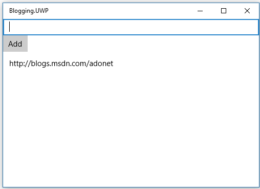

# Getting Started with EF Core on Universal Windows Platform (UWP) with a New Database

In this tutorial, you build a Universal Windows Platform (UWP) application that performs basic data access against a local SQLite database using Entity Framework.

[View this article's sample on GitHub](https://github.com/aspnet/EntityFramework.Docs/tree/master/samples/core/GetStarted/UWP/UWP.SQLite).

## Prerequisites

* [Windows 10 Fall Creators Update (10.0; Build 16299) or later](https://support.microsoft.com/en-us/help/4027667/windows-update-windows-10).

* [Visual Studio 2017 version 15.7 or later](https://www.visualstudio.com/downloads/) with the **Universal Windows Platform Development** workload.

* [.NET Core 2.1 SDK or later](https://www.microsoft.com/net/core) or later.

## Create a new model project

> [!IMPORTANT]
> Due to limitations in the way .NET Core tools interact with UWP projects the model needs to be placed in a non-UWP project to be able to run migrations commands in the **Package Manager Console** (PMC)

* Open Visual Studio

* **File > New > Project**

* From the left menu select **Installed > Visual C# > .NET Standard**.

* Select the **Class Library (.NET Standard)** template.

* Name the project *UWP.Model*.

* Name the solution *UWP*.

* Click **OK**.

## Install Entity Framework

To use EF Core, install the package for the database provider(s) you want to target. This tutorial uses SQLite. For a list of available providers see [Database Providers](../../providers/index.md).

* **Tools > NuGet Package Manager > Package Manager Console**.

* Run `Install-Package Microsoft.EntityFrameworkCore.Sqlite`

Later in this tutorial you will be using some Entity Framework Tools to maintain the database. So install the tools package as well.

* Run `Install-Package Microsoft.EntityFrameworkCore.Tools`

* Edit the *.csproj* file and replace `<TargetFramework>netstandard2.0</TargetFramework>` with `<TargetFrameworks>netcoreapp2.0;netstandard2.0</TargetFrameworks>`

## Create the model

Now it's time to define a context and entity classes that make up the model.

* Delete *Class1.cs*.

* Create *Model.cs* with the following code:

  [!code-csharp[Main](../../../../samples/core/GetStarted/UWP/UWP.Model/Model.cs)]

## Create a new UWP project

* In **Solution Explorer**, right-click the solution, and then choose **Add > New Project**.

* From the left menu select **Installed > Visual C# > Windows Universal**.

* Select the **Blank App (Universal Windows)** project template.

* Name the project *UWP.SQLite*, and click **OK**

* Set the target and minimum versions to at least **Windows 10 Fall Creators Update (10.0; build 16299.0)**.

## Create the initial migration

Now that you have a model, set up the app to create a database the first time it runs. In this section, you create the initial migration. In the following section, you add code that applies this migration when the app starts.

* **Tools > NuGet Package Manager > Package Manager Console**

* Select the model project as the **Default project**.

* In **Solution Explorer**, set the model project as the startup project.

* Run `Add-Migration InitialCreate`.

  This command scaffolds a migration that creates the initial set of tables for your model.

  If you get an error when you run the command, close and open Visual Studio.

## Create the database on app startup

Since you want the database to be created on the device that the app runs on, add code to apply any pending migrations to the local database on application startup. The first time that the app runs, this will take care of creating the local database.

* In the *UWP.Model* project, edit the *.csproj* file and make `netstandard2.0` the first target framework.

  ```
  <TargetFrameworks>netstandard2.0;netcoreapp2.1</TargetFrameworks>
  ```

* Close and reopen Visual Studio.

* In the *UWP.SQLite* project, add a reference to the *UWP.Model* project.

* Open *App.xaml.cs*.

* Add the highlighted code to apply any pending migrations.

[!code-csharp[Main](../../../../samples/core/GetStarted/UWP/UWP.SQLite/App.xaml.cs?highlight=1-2,26-29)]

> [!TIP]  
> If you change your model, use the `Add-Migration` command to scaffold a new migration to apply the corresponding changes to the database. Any pending migrations will be applied to the local database on each device when the application starts.
>
>EF uses a `__EFMigrationsHistory` table in the database to keep track of which migrations have already been applied to the database.

## Use the model

You can now use the model to perform data access.

* Open *MainPage.xaml*.

* Add the page load handler and UI content highlighted below

[!code-xml[Main](../../../../samples/core/GetStarted/UWP/UWP.SQLite/MainPage.xaml?highlight=9,11-23)]

Now add code to wire up the UI with the database

* Open *MainPage.xaml.cs*.

* Add the highlighted code from the following listing:

[!code-csharp[Main](../../../../samples/core/GetStarted/UWP/UWP.SQLite/MainPage.xaml.cs?highlight=1,31-49)]

You can now run the application to see it in action.

* In **Solution Explorer**, right-click the *UWP.SQLite* project and then select **Deploy**.

* Set *UWP.SQLite* as the startup project.

* **Debug > Start Without Debugging**

  The app builds and runs.

* Enter a URL and click the **Add** button




## Next steps

Tada! You now have a simple UWP app running Entity Framework Core.

> [!IMPORTANT]
> **Consider avoiding anonymous types in LINQ queries on UWP**. Deploying a UWP application to the app store requires your application to be compiled with .NET Native. Queries with anonymous types have worse performance on .NET Native.

> [!TIP]
> `SaveChanges()` performance can be improved by implementing [`INotifyPropertyChanged`](https://msdn.microsoft.com/en-us/library/system.componentmodel.inotifypropertychanged.aspx), [`INotifyPropertyChanging`](https://msdn.microsoft.com/en-us/library/system.componentmodel.inotifypropertychanging.aspx), [`INotifyCollectionChanged`](https://msdn.microsoft.com/en-us/library/system.collections.specialized.inotifycollectionchanged.aspx) in your entity types and using `ChangeTrackingStrategy.ChangingAndChangedNotifications`.

Check out other articles in this documentation to learn more about Entity Framework's features.
