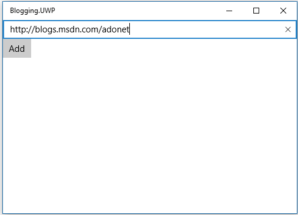

# Getting Started with EF Core on Universal Windows Platform (UWP) with a New Database

In this tutorial, you build a Universal Windows Platform (UWP) application that performs basic data access against a local SQLite database using Entity Framework Core.

[View this article's sample on GitHub](https://github.com/aspnet/EntityFramework.Docs/tree/master/samples/core/GetStarted/UWP).

## Prerequisites

* [Windows 10 Fall Creators Update (10.0; Build 16299) or later](https://support.microsoft.com/en-us/help/4027667/windows-update-windows-10).

* [Visual Studio 2017 version 15.7 or later](https://www.visualstudio.com/downloads/) with the **Universal Windows Platform Development** workload.

* [.NET Core 2.1 SDK or later](https://www.microsoft.com/net/core) or later.

> [!IMPORTANT]
> This tutorial uses Entity Framework Core [migrations](xref:core/managing-schemas/migrations/index) commands to create and update the schema of the database.
> These commands don't work directly with UWP projects.
> For this reason, the application's data model is placed in a shared library project, and a separate .NET Core console application is used to run the commands.

## Create a library project to hold the data model

* Open Visual Studio

* **File > New > Project**

* From the left menu select **Installed > Visual C# > .NET Standard**.

* Select the **Class Library (.NET Standard)** template.

* Name the project *Blogging.Model*.

* Name the solution *Blogging*.

* Click **OK**.

## Install Entity Framework Core runtime in the data model project

To use EF Core, install the package for the database provider(s) you want to target. This tutorial uses SQLite. For a list of available providers see [Database Providers](../../providers/index.md).

* **Tools > NuGet Package Manager > Package Manager Console**.

* Make sure that the library project *Blogging.Model* is selected as the **Default Project** in the Package Manager Console.

* Run `Install-Package Microsoft.EntityFrameworkCore.Sqlite`

## Create the data model

Now it's time to define the *DbContext* and entity classes that make up the model.

* Delete *Class1.cs*.

* Create *Model.cs* with the following code:

  [!code-csharp[Main](../../../../samples/core/GetStarted/UWP/Blogging.Model/Model.cs)]

## Create a new console project to run migrations commands

* In **Solution Explorer**, right-click the solution, and then choose **Add > New Project**.

* From the left menu select **Installed > Visual C# > .NET Core**.

* Select the **Console App (.NET Core)** project template.

* Name the project *Blogging.Migrations.Startup*, and click **OK**.

* Add a project reference from the *Blogging.Migrations.Startup* project to the *Blogging.Model* project.

## Install Entity Framework Core tools in the migrations startup project

To enable the EF Core migration commands in the Package Manager Console, install the EF Core tools package in the console application.

* **Tools > NuGet Package Manager > Package Manager Console**

* Run `Install-Package Microsoft.EntityFrameworkCore.Tools -ProjectName Blogging.Migrations.Startup`

## Create the initial migration

 Create the initial migration, specifying the console application as the startup project.

* Run `Add-Migration InitialCreate -StartupProject Blogging.Migrations.Startup`

This command scaffolds a migration that creates the initial set of database tables for your data model.

## Create the UWP project

* In **Solution Explorer**, right-click the solution, and then choose **Add > New Project**.

* From the left menu select **Installed > Visual C# > Windows Universal**.

* Select the **Blank App (Universal Windows)** project template.

* Name the project *Blogging.UWP*, and click **OK**

> [!IMPORTANT]
> Set the target and minimum versions to at least **Windows 10 Fall Creators Update (10.0; build 16299.0)**.
> Previous  versions of Windows 10 do not support .NET Standard 2.0, which is required by Entity Framework Core.

## Add code to create the database on application startup

Since you want the database to be created on the device that the app runs on, add code to apply any pending migrations to the local database on application startup. The first time that the app runs, this will take care of creating the local database.

* Add a project reference from the *Blogging.UWP* project to the *Blogging.Model* project.

* Open *App.xaml.cs*.

* Add the highlighted code to apply any pending migrations.

  [!code-csharp[Main](../../../../samples/core/GetStarted/UWP/Blogging.UWP/App.xaml.cs?highlight=1-2,26-29)]

> [!TIP]  
> If you change your model, use the `Add-Migration` command to scaffold a new migration to apply the corresponding changes to the database. Any pending migrations will be applied to the local database on each device when the application starts.
>
>EF Core uses a `__EFMigrationsHistory` table in the database to keep track of which migrations have already been applied to the database.

## Use the data model

You can now use EF Core to perform data access.

* Open *MainPage.xaml*.

* Add the page load handler and UI content highlighted below

[!code-xml[Main](../../../../samples/core/GetStarted/UWP/Blogging.UWP/MainPage.xaml?highlight=9,11-23)]

Now add code to wire up the UI with the database

* Open *MainPage.xaml.cs*.

* Add the highlighted code from the following listing:

[!code-csharp[Main](../../../../samples/core/GetStarted/UWP/Blogging.UWP/MainPage.xaml.cs?highlight=1,31-49)]

You can now run the application to see it in action.

* In **Solution Explorer**, right-click the *Blogging.UWP* project and then select **Deploy**.

* Set *Blogging.UWP* as the startup project.

* **Debug > Start Without Debugging**

  The app builds and runs.

* Enter a URL and click the **Add** button

  

  

  Tada! You now have a simple UWP app running Entity Framework Core.

## Next steps

For compatibility and performance information that you should know when using EF Core with UWP, see [.NET implementations supported by EF Core](../../platforms/index.md#universal-windows-platform).

Check out other articles in this documentation to learn more about Entity Framework Core features.
