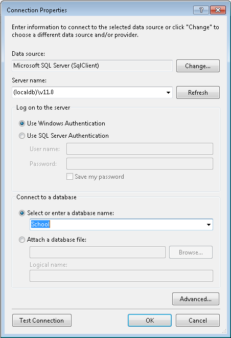
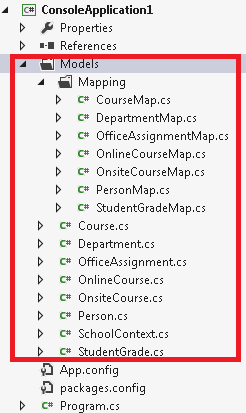
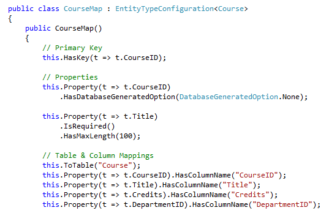
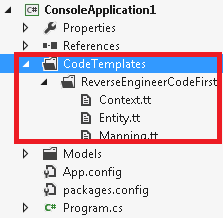

# Entity Framework Power Tools
This video and step-by-step walkthrough demonstrates the tasks that you can accomplish with the EF Power Tools. The EF Power Tools provide a preview of features that we are considering adding to the main Entity Framework tooling in a future release.

 

## Summary of Commands

The following context menu items are available after you install the EF Power Tools. These options are discussed in detail in this walkthrough: 

When you right-click on a C\# project, you will see:

-   **Reverse Engineer Code First** - Generates derived DbContext class, POCO classes, and Code First mapping classes for an existing database.
-   **Customize Reverse Engineer Templates** - Adds the default reverse engineer T4 templates to your project so you could customize code generation.

When you right-click on a file containing a derived DbContext class, you will see:

-   **View Entity Data Model(Read-only)** - Displays a read-only view of the Code First model in the EF Designer.
-   **View Entity Data Model XML**- Displays the EDMX XML representing the underlying Code First model.
-   **View Entity Data Model DDL SQL**- Displays the DDL SQL corresponding to the SSDL in the underlying EDM Model.
-   **Generate Views** - Generates pre-compiled views used by the EF runtime to improve start-up performance.  

When right-clicking on an EDMX file (that gets generated when you work with the EF Designer), you will see: 

-   **Generate Views** – same description as above.   

 

## Pre-Requisites

To complete this walkthrough, you need to have the following installed:  

-   Visual Studio 2012 or Visual Studio 2010
-   The latest version of [EF Power Tools](http://visualstudiogallery.msdn.microsoft.com/72a60b14-1581-4b9b-89f2-846072eff19d/) from Visual Studio Gallery
-   The [School Database](../ef6/entity-framework-school-database.md)

 

## Create the Application

This walkthrough uses Visual Studio 2012.

-   Open Visual Studio
-   **File -&gt; New -&gt; Project….**
-   Select **Windows** in the left pane and **Console** in the right pane
-   Enter **EFPowerToolsSample** as the name
-   Select **OK**

 

## Reverse Engineer Code First

The **Reverse Engineer Code First** command is used to generate the POCO, mapping (configuration), and derived DbContext classes that are based on an existing database.

-   Right click the project and select **Entity Framework** –&gt; **Reverse Engineer Code First**.
-   Enter the information about an existing database based on which you want to reverse engineer Code First
    **Note**: This will reverse engineer all the tables in the database, so if you do not want all of them, you will have to manually delete them from the model  

    

You can see the progress of the reverse engineer process in the status bar of Visual Studio. The following updates are made to your project when the process completes.

-   The configuration file (.config) is updated with the connection string
-   A reference to the **EntityFramework** NuGet package is added to the project
-   A DbContext derived class and a set of POCO classes are generated under the **Models** folder. Also, the mapping classes are generated under the **Mapping** folder that is nested under the **Models** folder. 

    

Re-running this command after the initial code generation overwrites the generated files.

If you are not completely satisfied with the way the classes were generated  you can edit them once they are generated or use the **Customize Reverse Engineer Templates** command described in the following section.

 

## Customize Reverse Engineer Templates

In some cases, you might want to change the way the code is being generated. For example, the generated code uses Fluent API to configure your model (as shown below), but you might want to use Data Annotations instead.



The rest of this section demonstrates how to modify code generation so that the table\\column mappings are configured to use Data Annotations instead of Fluent API (as shown below).

-   Right click the project and select **Entity Framework** –&gt; **CustomizeReverse Engineer Templates**
    *Selecting **CustomizeReverse Engineer Templates** adds the T4 templates to your project. The EF Power Tools then uses these templates to generate the code for your context, entities, and mapping classes.*  

    

    **Note**: You might see the following error caused by the fact that Visual Studio is trying to validate the templates. Because the templates are never run from your project, you can ignore it.*
    Compiling transformation: The type or namespace name ‘EfTextTemplateHost’ could not be found (are you missing a using directive or an assembly reference?)

Now it's time to edit the templates.

-   Open Mapping.tt file.
    First, we will remove the code that generates the Fluent API Table\\Column mapping
-   Search for **var tableSet = efHost.TableSetstring** in the file (make sure not to paste a space character).
-   Delete the code starting at this line and ending on the line above **// Find m:m relationships to configure**
    Below is the code that you would have to delete:
```
    var tableSet = efHost.TableSet;
    var tableName = (string)tableSet.MetadataProperties["Table"].Value
         tableSet.Name;
    var schemaName = (string)tableSet.MetadataProperties["Schema"].Value;
#>
            // Table & Column Mappings
\<#
    if (schemaName == "dbo" || string.IsNullOrWhiteSpace(schemaName))
    {
#>
            this.ToTable("\<#= tableName #>");
\<#
    }
    else
    {
#>
            this.ToTable("\<#= tableName #>", "\<#= schemaName #>");
\<#
    }
    foreach (var property in efHost.EntityType.Properties)
    {
#>
            this.Property(t => t.\<#= property.Name #>).HasColumnName("\<#= efHost.PropertyToColumnMappings[property].Name #>");
<#
    }
```
 

-   Save the **Mapping.tt** file
-   Open **Entity.tt** file
    We will now add the Data Annotation mapping to include the \[Table\] and \[Column\] attributes.  We will base the Data Annotation code on the Fluent API code we just deleted. You can of course modify it further. 
-   Paste the code that adds the **\[Table\]** attribute (shown in black) after the lines that are shown in light gray:
```
namespace \<#= code.EscapeNamespace(efHost.Namespace) #>
{
\<#
    var tableSet = efHost.TableSet;
    var tableName = (string)tableSet.MetadataProperties["Table"].Value
         tableSet.Name;
    var schemaName = (string)tableSet.MetadataProperties["Schema"].Value;
#>
\<#
    if (schemaName == "dbo" || string.IsNullOrWhiteSpace(schemaName))
    {
#>
    [Table("\<#= tableName #>")]
\<#
    }
    else
    {
#>
    [Table("\<#= tableName #>", Schema="\<#= schemaName #>")]
\<#
}
#>
```
 

-   Paste the code that adds the **\[Column\]** attribute (shown in black) after the lines that are shown in light gray:
```
foreach (var property in efHost.EntityType.Properties)
    {
#>
        [Column("\<#= efHost.PropertyToColumnMappings[property].Name #>")]
<#
```
 

-   We also need to add a using statement to specify where the Data Annotations are defined. In the current version of the Entity Framework they are defined in System.ComponentModel.DataAnnotations.Schema. Prior to that, they were defined in System.ComponentModel.DataAnnotations. We will add the following logic in order to add the correct using statement based on the EF version.
```
using System;
using System.Collections.Generic;
\<#
       if (efHost.EntityFrameworkVersion >= new Version(4, 4))
        {
#>
using System.ComponentModel.DataAnnotations.Schema;
\<#
        }
        else
        {
#>
using System.ComponentModel.DataAnnotations;
\<#
        }
#>
```
 

-   Save the **Entity.tt** file
-   Repeat the reverse engineer process, this time the custom templates will be used to generate code

 

**Note:** After you make changes to the T4 templates you must to do the following for the changes to be reflected in code generation:

-   Save the .tt files after you update them
-   Perform **Reverse Engineer CodeFirst**

 

## Viewing Entity Data Model

When you right-click on a file that contains a derived DbContext class definition, you will see the three EDM viewing options described in this section.


### View Entity Data Model (Read-only)

Even when developing with code first, you might want to graphically view your model. This View Entity Data Model option displays a read-only view of the Code First model in the EF Designer. Even though the designer will let you modify the model, you would not be able to save your changes.

### View Entity Data Model XML

This option allows you to view the EDMX XML representing the underlying Code First model. You probably will not be using this option on too many occasions. One case where you may need to use it is when debugging some Code First issues.

### View Entity Data Model DDL SQL

This option allows you to view the DDL SQL script that corresponds to the SSDL in the underlying EDM Model. You may want to use this option when you want to review the tables and columns that will get produced by your model. 

 

## Generating Pre-compiled Views

You can use **Generate Views** option to generate pre-compiled views that are used by the Entity Framework runtime to improve start-up performance. The generated views file is added to the project. You can read more about view compilation in the following article: [Performance Considerations](../ef6/performance-considerations-for-ef-4-5-and-6.md).

The **Generate Views** option is available when working with Code First and also when working with the EF Designer.

-   When working with Code First, **Generate Views** option is available when right-clicking on a file that contains a derived DbContext class.
-   When working with the EF Designer, **Generate Views** option is available when right-clicking on the EDMX file.

Note that, every time you change your model you need to re-generate the pre-compiled views by running the **GenerateViews** command again.
