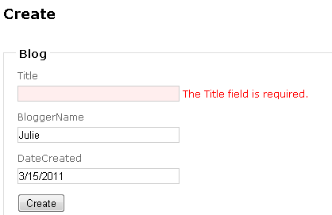
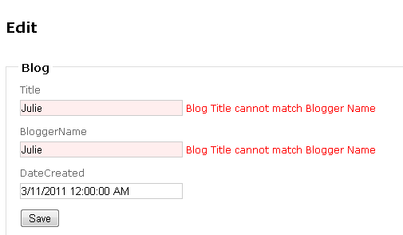

# Entity Framework Validation
> **EF4.1 Onwards Only** - The features, APIs, etc. discussed in this page were introduced in Entity Framework 4.1. If you are using an earlier version, some or all of the information does not apply

The content on this page is adapted from and article originally written by Julie Lerman ([http://thedatafarm.com](http://thedatafarm.com)).

Entity Framework provides a great variety of validation features that can feed through to a user interface for client-side validation or be used for server-side validation. When using code first, you can specify validations using annotation or fluent API configurations. Additional validations, and more complex, can be specified in code and will work whether your model hails from code first, model first or database first.

 

## The model

I’ll demonstrate the validations with a simple pair of classes: Blog and Post.

```
    public class Blog
      {
          public int Id { get; set; }
          public string Title { get; set; }
          public string BloggerName { get; set; }
          public DateTime DateCreated { get; set; }
          public virtual ICollection<Post> Posts { get; set; }
          }
      }

      public class Post
      {
          public int Id { get; set; }
          public string Title { get; set; }
          public DateTime DateCreated { get; set; }
          public string Content { get; set; }
          public int BlogId { get; set; }
          public ICollection<Comment> Comments { get; set; }
      }
```
 

## Data Annotations

Code First uses annotations from the System.ComponentModel.DataAnnotations assembly as one means of configuring code first classes. Among these annotations are those which provide rules such as the Required, MaxLength and MinLength. A number of .NET client applications also recognize these annotations, for example, ASP.NET MVC. You can achieve both client side and server side validation with these annotations. For example, you can force the Blog Title property to be a required property.

```
    [Required]
    public string Title { get; set; }
```

With no additional code or markup changes in the application, an existing MVC application will perform client side validation, even dynamically building a message using the property and annotation names.



In the post back method of this Create view, Entity Framework is used to save the new blog to the database, but MVC’s client-side validation is triggered before the application reaches that code.

Client side validation is not bullet-proof however. Users can impact features of their browser or worse yet, a hacker might use some trickery to avoid the UI validations. But Entity Framework will also recognize the Required annotation and validate it.

A simple way to test this is to disable MVC’s client-side validation feature. You can do this in the MVC application’s web.config file. The appSettings section has a key for ClientValidationEnabled. Setting this key to false will prevent the UI from performing validations.

```
    <appSettings>
        \<add key="ClientValidationEnabled"value="false"/>
        ...
    </appSettings>
```

Even with the client-side validation disabled, you will get the same response in your application. The error message “The Title field is required” will be displayed as. Except now it will be a result of server-side validation. Entity Framework will perform the validation on the Required annotation (before it even bothers to build and INSERT command to send to the database) and return the error to MVC which will display the message.

 

## Fluent API

You can use code first’s fluent API instead of annotations to get the same client side & server side validation. Rather than use Required, I’ll show you this using a MaxLength validation.

Fluent API configurations are applied as code first is building the model from the classes. You can inject the configurations by overriding the DbContext class’ OnModelCreating  method. Here is a configuration specifying that the BloggerName property can be no longer than 10 characters.

```
    public class BlogContext : DbContext
      {
          public DbSet<Blog> Blogs { get; set; }
          public DbSet<Post> Posts { get; set; }
          public DbSet<Comment> Comments { get; set; }

          protected override void OnModelCreating(DbModelBuilder modelBuilder)
          {
              modelBuilder.Entity<Blog>().Property(p => p.BloggerName).HasMaxLength(10);
          }
        }
```

Validation errors thrown based on the Fluent API configurations will not automatically reach the UI, but you can capture it in code and then respond to it accordingly.

Here’s some exception handling error code in the application’s BlogController class that captures that validation error when Entity Framework attempts to save a blog with a BloggerName that exceeds the 10 character maximum.

```
    [HttpPost]
    public ActionResult Edit(int id, Blog blog)
    {
        try
        {
            db.Entry(blog).State = EntityState.Modified;
            db.SaveChanges();
            return RedirectToAction("Index");
        }
        catch(DbEntityValidationException ex)
        {
            var error = ex.EntityValidationErrors.First().ValidationErrors.First();
            this.ModelState.AddModelError(error.PropertyName, error.ErrorMessage);
            return View();
        }
    }
```

The validation doesn’t automatically get passed back into the view which is why the additional code that uses ModelState.AddModelError is being used. This ensures that the error details make it to the view which will then use the ValidationMessageFor Htmlhelper to display the error.

```
                @Html.ValidationMessageFor(model => model.BloggerName)
```

## IValidatableObject

IValidatableObject is an interface that lives in System.ComponentModel.DataAnnotations. While it is not part of the Entity Framework API, you can still leverage it for server-side validation in your Entity Framework classes. IValidatableObject provides a Validate method that Entity Framework will call during SaveChanges or you can call yourself any time you want to validate the classes.

Configurations such as Required and MaxLength perform validaton on a single field. In the Validate method you can have even more complex logic, for example, comparing two fields.

In the following example, the Blog class has been extended to implement IValidatableObject and then provide a rule that the Title and BloggerName cannot match.

```
    public class Blog : IValidatableObject
     {
         public int Id { get; set; }
         [Required]
         public string Title { get; set; }
         public string BloggerName { get; set; }
         public DateTime DateCreated { get; set; }
         public virtual ICollection<Post> Posts { get; set; }

         public IEnumerable<ValidationResult> Validate(ValidationContext validationContext)
         {
             if (Title == BloggerName)
             {
                 yield return new ValidationResult
                  ("Blog Title cannot match Blogger Name", new[] { "Title", “BloggerName” });
             }
         }
     }
```

The ValidationResult constructor takes a string that represents the error message and an array of strings that represent the member names that are associated with the validation. Since this validation checks both the Title and the BloggerName, both property names are returned.

Unlike the validation provided by the Fluent API, this validation result will be recognized by the View and the exception handler that I used earlier to add the error into ModelState is unnecessary. Because I set both property names in the ValidationResult, the MVC HtmlHelpers display the error message for both of those properties.



## DbContext.ValidateEntity

DbContext has an Overridable method called ValidateEntity. When you call SaveChanges, Entity Framework will call this method for each entity in its cache whose state is not Unchanged. You can put validation logic directly in here or even use this method to call, for example, the Blog.Validate method added in the previous section.

Here’s an example of a ValidateEntity override that validates new Posts to ensure that the post title hasn’t been used already. It first checks to see if the entity is a post and that its state is Added. If that’s the case, then it looks in the database to see if there is already a post with the same title. If there is an existing post already, then a new DbEntityValidationResult is created.

DbEntityValidationResult houses a DbEntityEntry and an ICollection of DbValidationErrors for a single entity. At the start of this method, a  DbEntityValidationResult is instantiated and then any errors that are discovered are added into its ValidationErrors collection.

```
    protected override DbEntityValidationResult ValidateEntity (
        System.Data.Entity.Infrastructure.DbEntityEntry entityEntry,
        IDictionary\<object, object> items)
    {
        var result = new DbEntityValidationResult(entityEntry, new List<DbValidationError>());
        if (entityEntry.Entity is Post && entityEntry.State == EntityState.Added)
        {
            Post post = entityEntry.Entity as Post;
            //check for uniqueness of post title
            if (Posts.Where(p => p.Title == post.Title).Count() > 0)
            {
                result.ValidationErrors.Add(
                        new System.Data.Entity.Validation.DbValidationError("Title",
                        "Post title must be unique."));
            }
        }

        if (result.ValidationErrors.Count > 0)
        {
            return result;
        }
        else
        {
         return base.ValidateEntity(entityEntry, items);
        }
    }
```

 

## Explicitly triggering validation

A call to SaveChanges triggers all of the validations covered in this article. But you don’t need to rely on SaveChanges. You may prefer to validate elsewhere in your application.

DbContext.GetValidationErrors will trigger all of the validations, those defined by annotations or the Fluent API, the validation created in IValidatableObject (e.g., Blog.Validate), and the validations performed in the DbContext.ValidateEntity method.

The following code will call GetValidationErrors on the current instance of a DbContext. ValidationErrors are grouped by entity type into DbValidationRestuls. The code iterates first through the DbValidationResults returned by the method and then through each ValidationError inside.

```
    foreach (var validationResults in db.GetValidationErrors())
        {
            foreach (var error in validationResults.ValidationErrors)
            {
                Debug.WriteLine(
                                  "Entity Property: {0}, Error {1}",
                                  error.PropertyName,
                                  error.ErrorMessage);
            }
        }
```

 

## Other considerations when using validation

Here are a few other points to consider when using Entity Framework validation:

-   Lazy loading is disabled during validation.
-   EF will validate data annotations on non-mapped properties (properties that are not mapped to a column in the database).
-   Validation is performed after changes are detected during SaveChanges. If you make changes during validation it is your responsibility to notify the change tracker.
-   DbUnexpectedValidationException is thrown if errors occur during validation.
-   Facets that Entity Framework includes in the model (maximum length, required, etc.) will cause validation, even if there are not data annotations on your classes and/or you used the EF Designer to create your model.
-   Precedence rules:
    -   Fluent API calls override the corresponding data annotations
-   Execution order:
    -   Property validation occurs before type validation
    -   Type validation only occurs if property validation succeeds
-   If a property is complex its validation will also include:
    -   Property-level validation on the complex type properties
    -   Type level validation on the complex type, including IValidatableObject validation on the complex type

 

## Summary

The validation API in Entity Framework plays very nicely with client side validation in MVC but you don't have to rely on client-side validation. Entity Framework will take care of the validation on the server side for DataAnnotations or configurations you've applied with the code first Fluent API.

You also saw a number of extensibility points for customizing the behavior whether you use the IValidatableObject interface or tap into the DbContet.ValidateEntity method. And these last two means of validation are available through the DbContext, whether you use the Code First, Model First or Database First workflow to describe your conceptual model.
