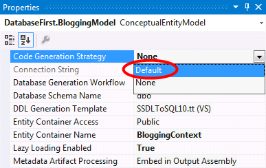

# Reverting to ObjectContext in Entity Framework Designer
With previous version of Entity Framework a model created with the EF Designer would generate a context that derived from ObjectContext and entity classes that derived from EntityObject.

Starting with EF4.1 we recommended swapping to a code generation template that generates a context deriving from DbContext and POCO entity classes.

In Visual Studio 2012 you get DbContext code generated by default for all new models created with the EF Designer. Existing models will continue to generate ObjectContext based code unless you decide to swap to the DbContext based code generator.

 

## Reverting Back to ObjectContext Code Generation

### 1. Disable DbContext Code Generation

Generation of the derived DbContext and POCO classes is handled by two .tt files in you project, if you expand the .edmx file in solution explorer you will see these files. Delete both of these files from your project.

If you are using VB.NET you will need to select the **Show All Files** button to see the nested files.

### 2. Re-Enable ObjectContext Code Generation

Open you model in the EF Designer, right-click on a blank section of the design surface and select **Properties**.

In the Properties window change the **Code Generation Strategy** from **None** to **Default**.

